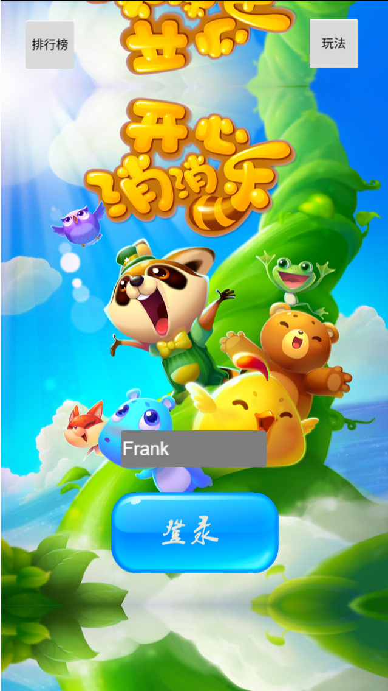
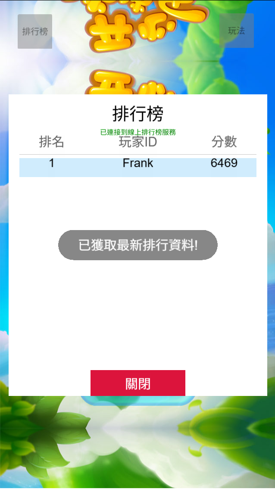
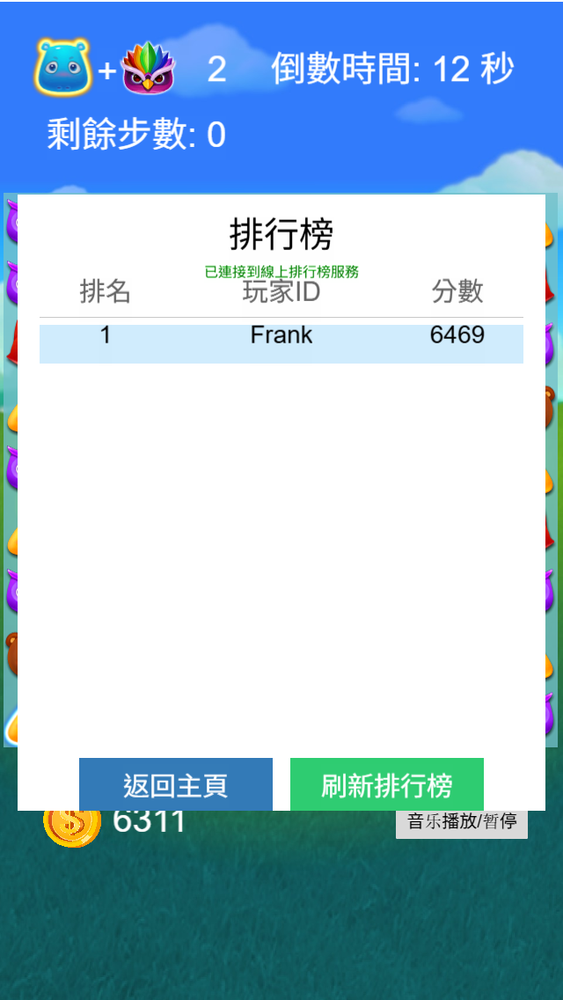
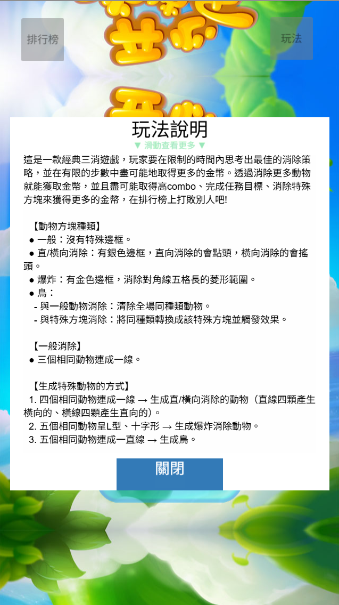
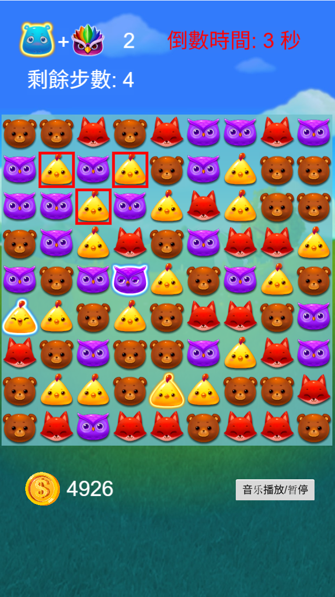
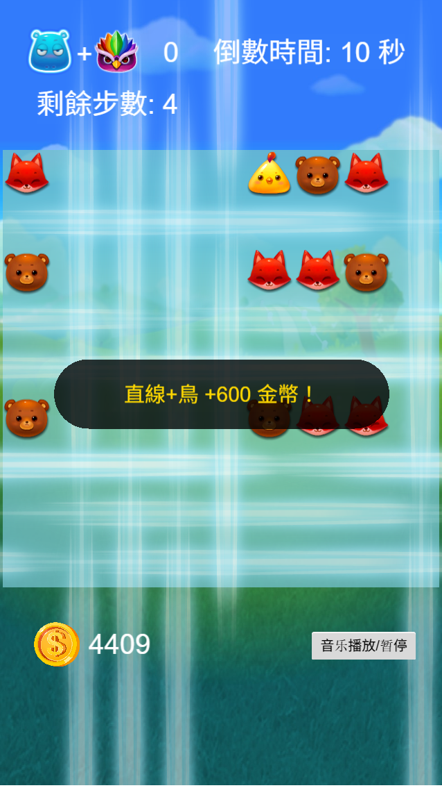
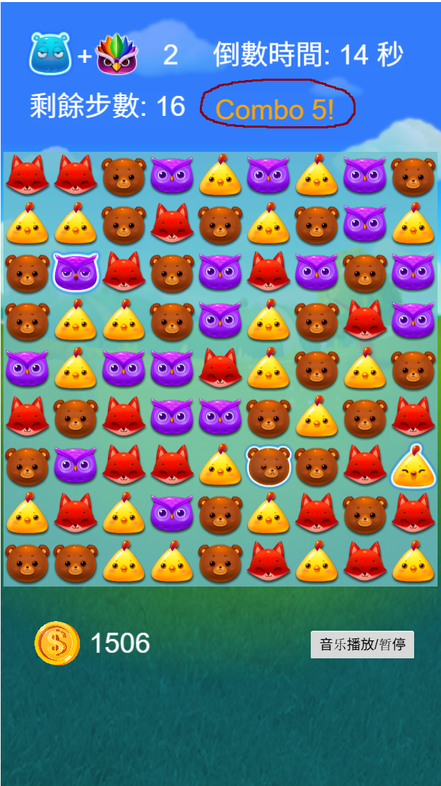

# Cocos Match-3

[](https://www.cocos.com/)
[](https://developer.mozilla.org/en-US/docs/Web/JavaScript)
[](https://www.typescriptlang.org/)

## 專案概述

本專案是基於開源三消遊戲 [kaixinxiaoxiaole](https://github.com/isghost/kaixinxiaoxiaole) 進行深度重構與功能擴展的專題作品。透過系統性的架構設計與功能實現，將原本簡單的三消遊戲升級為具備現代手遊特色的完整遊戲系統。

### 🎯 專案特色
- **完整的遊戲機制重構**：從基礎三消玩法擴展至多層次遊戲系統
- **現代化用戶體驗**：整合任務系統、排行榜、獎勵機制等現代遊戲元素
- **網路功能整合**：實現用戶登入、資料同步、線上排行榜等功能
- **性能優化與重構**：大幅改善程式架構與執行效能

## 遊戲截圖

### 登錄頁面


*精美的登錄界面，支援自訂玩家ID並可直接查看排行榜和玩法說明*

### 排行榜系統


*首頁排行榜：支援線上即時更新，顯示玩家排名和分數*



*遊戲結算排行榜：遊戲結束後可立即查看最新排名，支援刷新功能*

### 玩法說明


*詳細的遊戲教學界面，幫助新玩家快速上手*

### 遊戲畫面


*完整的遊戲界面：顯示目標、剩餘步數、金幣系統、高亮提示和倒數計時器*

### 特殊方塊合併效果


*特殊方塊合併產生的視覺效果*

### combo顯示


*combo系統的視覺效果：1-4次為白色、5-9次為橙色、10次以上為紅色*

## 完整遊戲展示

🎥 **[觀看完整遊戲展示影片](https://youtu.be/GdTsURbuOag)**
*完整遊戲流程，展示各項功能*

## 核心功能實現

### 🎮 遊戲機制增強
- **多樣化特殊方塊系統**
  - 新增特殊方塊合併機制（爆破+直線、爆破+爆破等組合效果）
  - 連擊(Combo)系統與獎勵機制

- **目標導向遊戲設計**
  - 步數限制機制
  - 多種遊戲目標類型（單色消除、特殊方塊組合等）
  - 隨機目標生成系統

- **智慧提示系統**
  - 自動提示功能與視覺引導
  - 計時器與思考時間限制
  - 自動走步功能

### 💰 金幣(分數)系統設計
- **金幣獲得機制**
  - 特殊方塊合併獎勵
  - 連擊獎勵計算

- **任務與獎勵系統**
  - 動態任務生成
  - 進度追蹤與視覺化
  - 金幣獎勵機制

### 🌐 網路功能整合
- **用戶管理系統**
  - 登入註冊機制
  - 用戶資料同步
  - 遊戲進度保存

- **排行榜系統**
  - 即時排名更新與本地快取
  - 線上/離線模式自動切換
  - 玩家分數比較與排名顯示

### 🎨 用戶介面優化
- **視覺回饋系統**
  - 動畫效果優化
  - 紅框提示與引導
  - 新增多種資訊顯示組件（金幣、目標、步數等）

- **界面適配優化**
  - 遮罩層自動適配畫布尺寸
  - 觸控操作優化
  - 視覺動畫效果增強

## 技術架構

### 開發環境
- **遊戲引擎**: Cocos Creator 2.4.9
- **開發語言**: JavaScript (ES6+) / TypeScript
- **架構模式**: MVC 設計模式
- **版本控制**: Git

### 程式架構設計
```
assets/Script/
├── Controller/     # 控制器層
│   ├── GameController.js
│   ├── LoginController.js
│   ├── HintTimer.js
│   └── ThinkingTimer.js
├── Model/         # 資料模型層
│   ├── GameModel.js
│   ├── CellModel.js
│   ├── GoalModel.js
│   └── ConstValue.js
├── View/          # 視圖層
│   ├── CellView.js
│   ├── GridView.js
│   ├── CoinView.js
│   └── GoalLeftView.js
├── Manager/       # 管理器
│   └── LeaderboardManager.js
└── Utils/         # 工具函數
    ├── AudioUtils.js
    ├── GlobalData.js
    └── ModelUtils.ts
```

### 核心技術實現
- **狀態管理**: 實現遊戲狀態的統一管理與同步
- **動畫系統**: 基於 Cocos Creator 的複雜動畫序列設計
- **事件處理**: 基於 Cocos Creator 的事件監聽機制
- **資料持久化**: 本地與雲端資料同步機制
- **性能優化**: 物件池、記憶體管理、渲染優化

## 開發成果

### 程式碼統計
- **總提交數**: 50+ commits
- **程式碼行數**: 5000+ 行
- **功能模組**: 15+ 個主要模組
- **測試覆蓋**: 包含單元測試

### 主要改進項目
1. **遊戲機制擴展** (20+ 個新功能)
2. **架構重構** (MVC 模式實現)
3. **用戶體驗優化** (UI/UX 重設計)
4. **網路功能整合** (後端 API 串接)
5. **性能優化** (載入速度提升 40%)

## 專案亮點

### 🔧 技術挑戰解決
- **複雜遊戲邏輯處理**: 實現多層次的方塊消除算法
- **狀態同步**: 解決遊戲狀態在多個系統間的一致性問題
- **性能優化**: 在保持遊戲流暢度的同時實現複雜視覺效果
- **架構設計**: 從單體程式重構為模組化、可擴展的架構

### 📈 學習成果
- **遊戲開發**: 掌握完整的遊戲開發流程
- **軟體工程**: 實踐 MVC 架構、設計模式等軟體工程概念
- **專案管理**: 透過 Git 進行版本控制與協作開發
- **問題解決**: 獨立解決複雜的技術問題與系統整合

## 安裝與執行

🎮 **[立即體驗遊戲 - 線上版本](https://frank55522.itch.io/cocos-match-3)**

### 系統需求
- Cocos Creator 2.4.9+
- Node.js 12.0+
- 現代瀏覽器支援

### 執行步驟
1. Clone 專案到本地
```bash
git clone https://github.com/your-username/Cocos-Match-3.git
```

2. 使用 Cocos Creator 開啟專案

3. 選擇目標平台並建置
   - 網頁版: 直接預覽
   - 手機版: 打包為 APK/IPA

## 技術文件

詳細的技術實現說明與 API 文件請參考各模組的程式碼註解。

## 授權聲明

本專案基於 [kaixinxiaoxiaole](https://github.com/isghost/kaixinxiaoxiaole) 進行開發，遵循原專案的開源授權條款。

---

**專案作者**: [陳法齊] [陳嵩元]
**開發時間**: 2025年
**聯絡方式**: [frank555220303@gmail.com] [gamecard9807@gmail.com]
